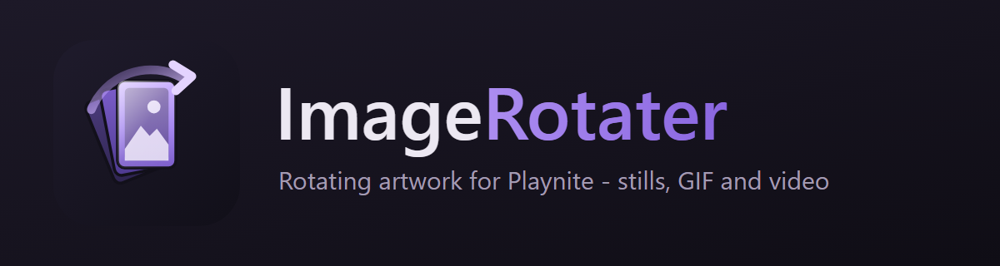

<p align="center">
  
</p>

<p align="center">
  Rotating artwork for <a href="https://playnite.link/">Playnite</a> — stills, GIF and video, in Desktop and Fullscreen.
</p>

<p align="center">
  
  
  
  
</p>

<p align="center">
  📥 <a href="#installation">Install</a>
  &nbsp;&middot;&nbsp;
  ⚙️ <a href="#settings">Settings</a>
  &nbsp;&middot;&nbsp;
  🎨 <a href="docs/THEME_INTEGRATION.md">Theme guide</a>
  &nbsp;&middot;&nbsp;
  📝 <a href="CHANGELOG.md">Changelog</a>
</p>

<p align="center">
  <a href="https://ko-fi.com/huddini">
    
  </a>
</p>

Give a game more than one background or cover and ImageRotater shows a different one each time you
look — or cycles through them while you linger. Stills work in every theme with nothing to add;
animated GIF and MP4 covers and backgrounds play wherever a theme hosts the plugin's one-line
element.

## What's New — v1.0.0

- **Playnite 10.57 support.** Fullscreen grid covers now rotate through Playnite's own tile — the
  one-line fix that makes it possible was
  [submitted from this project](docs/THEME_INTEGRATION.md#the-fullscreen-grid-cover-problem-fixed-in-playnite-1057)
  and the plugin-side workarounds are gone.
- **Transitions.** Crossfade, fade through black, fade through white, or cut — chosen separately for
  covers and backgrounds, applied identically in Desktop and Fullscreen.
- **Four artwork sources.** Steam's own store art and trailers, SteamGridDB, web image search, and
  YouTube (saved as MP4), all from one search dialog with a live preview.
- **Library tools.** Bulk-convert GIFs to MP4 and JPEGs to PNG, repair videos that render as black
  tiles, repair dangling artwork references, or reset everything back to the original art.
- **New settings page.**

## Features

- **Rotates backgrounds and covers** from a per-game folder you control — pick once per session,
  pick again on every selection, or run a slideshow while a game stays selected.
- **Plays motion artwork.** Animated GIF and MP4 backgrounds and covers, through the plugin's own
  renderer, on the selected tile or on every tile.
- **Every theme, out of the box, for stills.** The plugin writes Playnite's own
  `Game.CoverImage` / `Game.BackgroundImage`; Playnite draws them. Nothing for a theme to do.
- **One line for motion.** A theme places `ImageRotater_Cover` / `ImageRotater_Background` and video
  plays there. Themes built for BackgroundChanger's element names are answered too.
- **Search and download** from Steam, SteamGridDB, the web and YouTube, with shape and style
  filters and an in-dialog preview.
- **Your artwork is preserved.** Existing art is copied into the plugin's folder before anything is
  replaced, rotates as a normal candidate, and can be put back in one click.
- **Opt-in per game.** Games you never set up are left completely alone.

## Usage

Right-click a game → **ImageRotater** → *Backgrounds* or *Covers*:

| Command | What it does |
|---|---|
| Add artwork files… | Copy images or video from disk into this game's folder |
| Search images online… | Steam, SteamGridDB, web and YouTube in one dialog, with preview |
| Download from SteamGridDB (automatic) | Take the best match without asking |
| Open folder | Open this game's artwork folder |
| Remove all | Clear this game's artwork |

**Backgrounds** rotate as you *leave* a game, so the next visit lands clean. **Covers** rotate as
you *arrive*, and the tile changes while you watch.

## Settings

Five pages. The master switch on General governs everything.

### Setup

| Setting | What it unlocks |
|---|---|
| SteamGridDB API key | The SteamGridDB tab of the search dialog. Free at steamgriddb.com → Preferences → API. |
| ffmpeg | GIF → MP4 conversion, video repair, and YouTube downloads. Not bundled (GPL). |
| yt-dlp | The YouTube tab. |
| deno | yt-dlp's JavaScript runtime; without it YouTube returns nothing. |

Leave a path blank and the plugin looks on your `PATH`.

### General

| Setting | Default | What it does |
|---|---|---|
| Enable rotation | On | The master switch. |
| Work with themes built for BackgroundChanger | On | Answers to BackgroundChanger's element names. BackgroundChanger itself must be disabled. Restart to apply. |
| Enable debug logging | Off | Writes `ImageRotater.log` to the plugin data folder. |

### Backgrounds

| Setting | Default | What it does |
|---|---|---|
| Transition *(Animation page)* | Crossfade | Crossfade, fade through black, fade through white, or cut. |
| Letterbox odd-shaped backgrounds | On | Pins ultrawide and square art to a screen-shaped canvas over a blurred fill of itself. Originals untouched. |
| Level background sizes | On | Publishes every background for a game at one width, so Playnite's blur stops jumping between them. |
| When a game has several | Pick once per session | Or pick again every time the game is selected, or always the same image. |
| Slideshow | Off | Change the background every N seconds while a game stays selected. |

### Covers

| Setting | Default | What it does |
|---|---|---|
| Rotate cover art | Off | Off by default — covers are usually curated deliberately. |
| Play animated covers on every tile | Off | Otherwise only the selected tile animates. Every animated tile decodes continuously in a 32-bit process; leave off for big video libraries. |
| Transition *(Animation page)* | Crossfade | As for backgrounds, chosen independently. |
| When a game has several | Pick once per session | As for backgrounds. |
| Slideshow | Off | Change the cover every N seconds while a game stays selected. |

### Library

Convert all GIFs to MP4 · Convert all JPEGs to PNG · Repair videos (fix black tiles) · Repair
artwork references · Reset library (deletes every plugin image and restores the original art).

## Theme authors

Stills need nothing from you. For GIF and video, add one `ContentControl` next to your own cover or
background element and leave that element as it is. The
[theme guide](docs/THEME_INTEGRATION.md) has the checklist, the exact markup, a worked example
against Aniki ReMake, and the two things not to do.

## Requirements

- Playnite **10.57 or newer** (Desktop or Fullscreen)
- Windows with .NET Framework 4.6.2
- Optional: [ffmpeg](https://ffmpeg.org/), [yt-dlp](https://github.com/yt-dlp/yt-dlp) and
  [deno](https://deno.com/) for conversion and YouTube; a free
  [SteamGridDB API key](https://www.steamgriddb.com/profile/preferences/api) for that source

MP4/H.264 plays everywhere. WebM needs a decoder Windows does not ship. ImageRotater cannot run
alongside BackgroundChanger — Playnite hands a shared element name to whichever plugin claims it
first.

## Installation

Download the `.pext` from [Releases](../../releases) and open it with Playnite, or drag it onto a
running Playnite window.

## Troubleshooting

Turn on **Enable debug logging** and attach
`%AppData%\Playnite\ExtensionsData\72b7d457-0621-429b-8368-665bc53ff896\ImageRotater.log` to
your report — it is fresh each session and records every selection and rotation. Artwork lives
next to it under `Images\{game id}\`.

## Building from source

```bash
dotnet clean -c Release
dotnet build -c Release
powershell -ExecutionPolicy Bypass -File scripts/package_extension.ps1
```

`version.txt` is the single source of truth; the packaging script stamps `extension.yaml` and
`AssemblyInfo.cs` from it and refuses to package a stale build. Tests: `dotnet test -c Release`.
Branding rasters: `scripts/build_branding.ps1` (headless Edge, no other tools).

## License

MIT — see [LICENSE](LICENSE).
